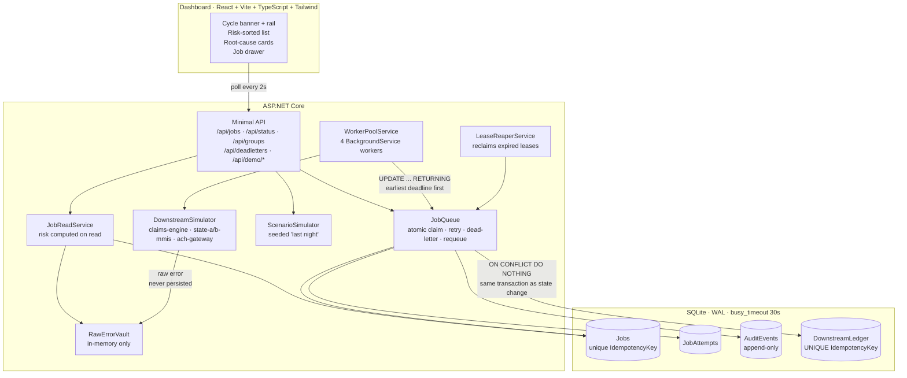
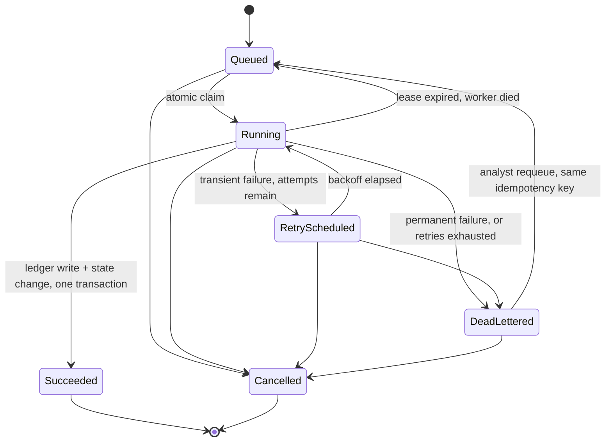

# CycleGuard

**Most job dashboards sort by when something failed. CycleGuard sorts by when it will cost you.**

An overnight batch-cycle console for Medicaid claims operations: a DB-backed job queue with
exponential backoff, dead-lettering and lease recovery, wrapped in a dashboard that ranks
stuck work by dollars and deadlines instead of by timestamp.

All data is synthetic. No real payer, provider, member or dollar figure appears anywhere in
this repository.

---

## Who it is for

**Priya, Claims & Payments Operations Analyst at a Medicaid services contractor.** She owns the
overnight batch cycle: claims adjudication, encounter submissions to state systems, and payment
runs. At 8:45am she has about thirty seconds to answer three questions:

1. What is stuck?
2. What will cost money?
3. What will heal on its own without her?

Two facts make those questions sharp. Her company publicly advertises that it has never missed
a payment cycle. And prior-authorisation decisions now carry enforceable regulatory deadlines —
72 hours expedited, 7 calendar days standard — so "late" is a compliance event, not an
inconvenience.

A conventional dashboard answers none of those three questions. It shows her a reverse-chronological
list of failures, in which a $9,500 disbursement 40 minutes from its deadline sits below a $4
encounter submission that failed more recently.

**Priya is a hypothesis, built from public information about how Medicaid contractors and
state MMIS systems work.** She is not a real person and was not interviewed. Treat the persona
as a design constraint, not as research.

## Prior art, honestly

CycleGuard is not the first thing to do most of this, and it would be dishonest to imply
otherwise.

- **Enterprise workload automation** (Control-M, AutoSys, Tidal and friends) has predicted
  SLA and deadline breaches for years, with far more operational maturity than this.
- **[Hangfire](https://www.hangfire.io/)** already gives .NET a persistent job queue with
  automatic retries, a dashboard, and a requeue button. If you want a production job queue for
  a .NET app, use Hangfire, not this.
- **Temporal, Sidekiq Pro, Celery + Flower** and most cloud queue services cover retries,
  backoff, dead-letter queues and visibility.

What CycleGuard adds is a **healthcare-operations layer** that those tools leave to you:

| | Generic job dashboard | CycleGuard |
| --- | --- | --- |
| Primary sort | When it failed | **When it breaches a deadline** |
| Failure grouping | By job class or exception type | **By downstream endpoint + failure signature** |
| Business impact | Absent | **Dollars at stake per job, summed by risk** |
| Error text | Raw, whatever the exception said | **PHI-masked before it is persisted or returned** |
| Explanation | Stack trace | **Deterministic plain-English cause and action** |
| Requeue safety | Re-runs the job | **Reuses the idempotency key; downstream refuses a second effect** |
| Scheduling | FIFO or priority | **Earliest deadline first** |

The pieces are individually unremarkable. The combination — and specifically making
*time to money* the organising principle rather than an optional column — is the argument.

---

## Running it

### Prerequisites

- **.NET 10 SDK** (`dotnet --version` should print `10.0.x`)
- **Node.js 20 or newer** (`node --version`)

If the SDK lives under `~/.dotnet` and Node under `nvm`, `run.sh` finds both without any
shell-profile changes.

### One command

```bash
./run.sh
```

That starts the API on **http://localhost:5179** (Swagger at `/swagger`) and the dashboard on
**http://localhost:5173**, and stops both on Ctrl+C. First run installs the dashboard's npm
dependencies.

Then open http://localhost:5173 and click **Simulate last night**.

### Two terminals, if you prefer

```bash
# terminal 1 — API
dotnet run --project src/CycleGuard.Api/CycleGuard.Api.csproj --urls http://localhost:5179
```

```bash
# terminal 2 — dashboard
cd web && npm install && npm run dev
```

### Tests

```bash
dotnet test
```

### Driving it from the command line

```bash
curl -s -X POST http://localhost:5179/api/demo/scenarios/last-night | python3 -m json.tool
```

```bash
curl -s 'http://localhost:5179/api/status' | python3 -m json.tool
```

```bash
curl -s 'http://localhost:5179/api/jobs?risk=Breached&limit=5' | python3 -m json.tool
```

The demo is seeded from a fixed seed (`CycleGuard:Demo:Seed`, default `20260115`), so the same
story appears every single run.

---

## Architecture



### How a job moves



Anything not on that diagram throws `IllegalStateTransitionException`. The table is published
at `GET /api/state-machine` and enforced by
[`JobStateMachine`](src/CycleGuard.Api/Domain/JobStateMachine.cs).

---

## The risk model, in short

Five levels, checked in order, first match wins:

1. `Done` — succeeded, or cancelled by an operator
2. `Breached` — past its deadline and not succeeded
3. `NeedsHuman` — dead-lettered and unresolved
4. `AtRisk` — thin slack, **or** the next retry lands after the deadline, **or** the remaining
   backoff cannot fit before the deadline
5. `OnTrack` — everything else

The third `AtRisk` clause is the interesting one. A job can be inside its deadline, with retries
left and a retry scheduled soon, and still be arithmetically doomed. That case is invisible to a
dashboard sorted by failure time.

Dollars at risk sums `AmountAtStakeCents` across `Breached`, `NeedsHuman` and `AtRisk`. Money is
integer cents throughout; nothing about money is a float.

Full rules and two worked examples: **[docs/risk-model.md](docs/risk-model.md)**.

### Failure classes

| Class | Examples | Behaviour |
| --- | --- | --- |
| `Transient` | timeout, HTTP 503, endpoint outage, expired lease | Retries with exponential backoff |
| `Permanent` | missing member id, unknown provider id, invalid procedure code, closed bank account | Straight to dead-letter, **no retries** |

`delay = min(cap, base × 2^(attempt−1))`, with optional jitter seeded from `(jobId, attempt)` so
a demo replay is identical. Configurable globally and per job type in `appsettings.json`.

---

## The 2-minute demo

1. **The banner.** "About 300 jobs ran overnight before the payment cycle closes. *N* need
   attention, and *$X* is at risk." The cycle countdown ticks in compressed cycle time; the rail
   underneath pins every at-risk job at the moment it runs out of time.

2. **The sort.** The list is ordered by time to breach, not by when anything failed. A
   $95,000 disbursement 40 minutes out sits above a $4 encounter that failed thirty seconds ago.

3. **One cause, dozens of symptoms.** A root-cause card reads `state-b-mmis · endpoint outage`
   over about forty jobs, tagged **↻ HEALING**. One endpoint explains all of them, and it is
   recovering on its own — the outage lifts roughly 24 real seconds in, and the stalled jobs
   succeed on their fifth attempt. Click the card to filter the list. Priya does not need to do
   anything about any of it. (The seeded scenario stalls 20 jobs deliberately; the rest are
   ordinary encounter submissions that happen to target the same endpoint.)

4. **A permanent failure.** Open one of the eight dead letters. The drawer shows the masked
   error, the attempt timeline, the upcoming backoff schedule, and a plain-English cause with a
   suggested action. Toggle **show raw** to see the synthetic PHI the endpoint actually returned
   — member id, name, date of birth, SSN-shaped number, phone, email — none of which reached the
   database.

5. **Requeue cannot double-pay.** Requeue a payment job with a name and a note. Requeue it
   again: the second attempt is refused with a 409, because it is no longer dead-lettered. The
   **duplicates prevented** counter in the banner shows the disbursements the downstream ledger
   refused to apply twice.

6. **Kill a worker.** The seeded scenario already contains one: a payment job left `Running`
   by `worker-3` with a lease that has already lapsed. Within a second the reaper reclaims it,
   another worker runs attempt 2, and the timeline reads `attempt 1 worker-3 LeaseExpired` then
   `attempt 2 worker-2 Succeeded` — one disbursement, full history kept.

   **Kill a worker mid-job** does the same thing to a job running right now. It only lands if a
   job is genuinely in flight when you press it: jobs finish in milliseconds, so if the queue has
   drained it returns `409` and tells you to try again while it is busy.

---

## API

| Method | Route | Purpose |
| --- | --- | --- |
| `POST` | `/api/jobs` | Enqueue a job. Duplicate idempotency key → `409` |
| `GET` | `/api/jobs?state=&risk=&endpoint=&limit=` | List jobs, sorted by time to breach |
| `GET` | `/api/jobs/{id}` | Attempts, backoff schedule, masked errors, audit events |
| `POST` | `/api/jobs/{id}/requeue` | Requeue from dead-letter. Requires `analyst` and `note` |
| `GET` | `/api/deadletters` | Dead letters grouped by cause |
| `GET` | `/api/status` | Counts, dollars at risk, cycle countdown, throughput, retry rate |
| `GET` | `/api/groups` | Root-cause groups by (endpoint, failure signature) |
| `GET` | `/api/state-machine` | The legal transition table |
| `GET` | `/api/causes` | The failure-signature → plain-English rule table |
| `POST` | `/api/demo/scenarios/last-night` | Seed the deterministic overnight scenario |
| `POST` | `/api/demo/reset` | Clear everything |
| `POST` | `/api/demo/timescale` | Change time compression (1–3600) |
| `POST` | `/api/demo/kill-worker` | Expire a running payment job's lease |

Swagger UI at `/swagger`.

---

## Engineering notes

The things that actually took the work:

- **The claim is one statement.** `UPDATE Jobs SET ... WHERE Id = (SELECT ... ORDER BY
  DeadlineTicks LIMIT 1) RETURNING *`. No read-then-write anywhere on the hot path, so two
  workers can never hold one job. "Now" is always a bound parameter — never SQL `datetime('now')`
  — which is what keeps the engine testable on a fake clock.
- **SQLite is configured properly.** `journal_mode=WAL` once at startup;
  `busy_timeout=30000` on **every** connection via an EF Core connection interceptor, because
  `busy_timeout` is per-connection and cannot be set from a connection-string keyword. A test
  runs eight workers over 300 jobs through the full write path and asserts zero `SQLITE_BUSY`.
- **All instants are UTC ticks in `long` columns.** No `DateTimeOffset` is stored or compared.
- **`TimeProvider` everywhere**, including `Task.Delay(delay, timeProvider, ct)`. Tests use
  `FakeTimeProvider` and `Advance()` to test backoff, retries and deadline breaches without
  waiting.
- **The default time scale is 20×**, so a four-hour cycle plays out in twelve real minutes and a
  45-second backoff waits 2.25 seconds. The dashboard can change it from 1× to 600× live. The
  value is not arbitrary: it has to leave the seeded outage shorter than the retry budget of the
  jobs stuck behind it, or the demo's self-healing endpoint turns into a pile of dead letters
  (see [docs/WHAT_BROKE.md](docs/WHAT_BROKE.md)).
- **Idempotency is enforced by the database.** A `UNIQUE` index on the ledger's key, written
  with `ON CONFLICT DO NOTHING`; zero rows affected means "already applied". The ledger write and
  the job state change share one transaction. Requeue is a conditional
  `UPDATE ... WHERE State = 'DeadLettered'`, so three simultaneous requeues produce exactly one
  winner.

### Tests

```
dotnet test
```

Covers: backoff maths and cap · retry cutoff and dead-letter routing (transient vs permanent) ·
illegal state transitions · atomic claim under concurrency (300 jobs, 8 workers, zero double
processing) · zero `SQLITE_BUSY` under eight concurrent writers · earliest-deadline-first
ordering · lease expiry recovery · every branch of the risk model · PHI masking (23 table cases
plus multi-field and stack-trace cases) · three concurrent requeues producing exactly one
disbursement · and an end-to-end HTTP test where a fail-twice-then-succeed job shows the
expected attempt sequence.

---

## ADRs

### ADR-1: A database-backed queue, not a message broker

**Decision.** Jobs live in a SQLite table. Workers claim them with a single atomic `UPDATE`.

**Why.** The differentiators all need queryable state. "Dollars at risk right now", "sorted by
time to breach", "grouped by endpoint and signature" are all queries over the *current* set of
pending work. A broker gives you a stream of messages, not a queryable set — so you end up
keeping a database alongside it anyway, and now two things can disagree about reality.

Earliest-deadline-first also needs a global view of what is pending. Broker priority classes are
a coarse approximation; `ORDER BY DeadlineTicks LIMIT 1` is the actual thing.

**Costs, accepted.** One SQLite file does not scale past a single machine, and the claim
serialises writers. At the volumes this targets — an overnight batch cycle of hundreds to low
thousands of jobs — that is not the constraint. It also means the demo runs offline with no
infrastructure.

### ADR-2: Earliest-deadline-first scheduling

**Decision.** Workers claim the ready job with the nearest deadline, not the oldest.

**Why.** FIFO optimises for fairness. Priya is not trying to be fair to jobs; she is trying not
to miss a payment cycle or a 72-hour prior-authorisation deadline. EDF is the classic optimal
policy when the objective is minimising deadline misses.

Concretely: with a thousand jobs queued and one payment run 40 minutes from cycle close, FIFO
puts the payment run behind nine hundred encounter submissions that are due tomorrow.

**Costs, accepted.** EDF can starve far-future work while near-deadline work keeps arriving, and
it is only optimal under assumptions this system does not guarantee. Both are acceptable because
the deadline distribution here is known and bounded by the cycle. The claim orders by
`DeadlineTicks, Id`, so ties break deterministically.

### ADR-3: Mask PHI at the persistence boundary, with regex rules

**Decision.** Exception messages and stack traces pass through
[`PhiMasker`](src/CycleGuard.Api/Domain/PhiMasker.cs) before they are written to the database or
returned from the API. Ordered regex rules cover member identifiers, dates of birth,
SSN-shaped numbers, phone numbers, emails and `Name:` fields.

**Why.** The realistic failure mode is not a deliberate PHI dump; it is an upstream system
echoing the record it rejected into an error string, which then lands in a log, a database and a
dashboard. Masking at the single point where error text is persisted catches that whole class of
accident without asking every caller to remember.

**This is defense in depth, not a compliance certification.** Regexes do not understand text.
An unusual identifier format or a free-text field containing a name in prose will get through.
Nothing here constitutes a HIPAA control, an audit, or a substitute for not putting PHI in
exceptions in the first place.

**Costs, accepted.** Ordering matters and is load-bearing (SSN before phone, labelled before
bare), so the rule list is fragile to careless edits — hence 23 table-driven cases pinning it
down. Masking is lossy by design: a masked message cannot be un-masked. And because nothing raw
is persisted, showing raw versus masked in the demo needs an in-memory side channel
(`RawErrorVault`), which does not survive a restart.

### ADR-4: No AI in retry, risk or requeue decisions

**Decision.** Every decision is a deterministic rule. Backoff is arithmetic. Risk is an ordered
rule list. Failure classification is a lookup table. Plain-English causes come from a hand-written
map from signature to sentence. There is no model, no scoring, no inference anywhere in this
codebase.

**Why.** Three reasons, in order of weight.

1. **Auditability.** Every state change writes an append-only audit row naming an actor. "Why
   did this retry?" must be answerable by pointing at a rule, not at a probability. In a
   regulated payment flow, "the model thought so" is not an answer.
2. **Determinism.** The same inputs must produce the same decision every time, which is what
   makes the seeded demo reproducible and the tests meaningful.
3. **It would not help.** Backoff is arithmetic. Deadline arithmetic is arithmetic. The failure
   signatures come from a closed set of downstream systems. There is no part of this where
   pattern recognition beats a lookup table.

**Costs, accepted.** The rule table only explains failures someone has written a rule for;
anything else falls through to `unknown` with an honest "no rule matched, read the masked error"
message. Adding a new downstream system means adding rules by hand. That is the right trade for
a system that moves money.

---

## Limitations

Stated plainly, because a demo that oversells itself is worse than one that does not exist.

- **The persona is a hypothesis.** Priya was not interviewed. She is assembled from public
  information about Medicaid contractors and state MMIS systems.
- **All data is synthetic.** Job types, endpoints, members, providers and dollar amounts are
  invented. Fake SSNs use the never-issued 900 area; phones use the 555 exchange; emails use
  `example.org`.
- **PHI masking is defense in depth, not compliance.** See ADR-3. It is regexes. It will miss
  formats it has never seen.
- **The no-double-pay guarantee is narrower than it sounds.** The ledger's `UNIQUE` key prevents
  a *retried or requeued* job from applying its effect twice. It does **not** deduplicate two
  logically identical payments that arrive under different keys — that is a data-identity
  problem, and no idempotency key can solve it. The simulator demonstrates the narrow guarantee
  by deliberately pointing two distinct jobs at one downstream key.
- **The downstream systems are mocks.** There is no real claims engine, MMIS or ACH gateway. The
  simulator decides success and failure from a scripted payload and an outage registry.
- **One SQLite file, one machine.** No horizontal scaling, no leader election. See ADR-1.
- **Risk is computed in memory** over at most 5,000 jobs per request. Fine for 300; a real
  deployment would push the arithmetic into SQL.
- **Time compression is a demo device.** Deadlines are written as real instants at the scale in
  force when they were created. Changing the time scale afterwards does not move them.
- **Raw error text does not survive a restart.** It is deliberately in-memory only.
- **Throughput is measured over the trailing real minute**, not the simulated one, so at high
  time scales it reads low relative to the cycle clock.
- **No authentication.** Anyone who can reach the port can requeue a payment job. The analyst
  name on a requeue is typed, not verified — it is an audit trail, not an identity claim.

---

## Repository layout

```
src/CycleGuard.Api/
  Domain/        job model, state machine, backoff, risk, PHI masking, cause rules
  Data/          EF Core context, SQLite pragma interceptor, WAL bootstrapper
  Queue/         atomic claim, retry scheduling, dead-lettering, safe requeue
  Downstream/    mock endpoints, outage registry, synthetic error text, raw-error vault
  Workers/       worker pool, job executor, lease reaper
  Demo/          seeded 'last night' scenario
  Api/           minimal API routes, DTOs, read/query service
web/             React + Vite + TypeScript + Tailwind dashboard
tests/           xUnit suite
docs/            risk model, decisions, bugs hit while building
```

## Further reading

- [docs/risk-model.md](docs/risk-model.md) — every rule, with two worked examples
- [docs/DECISIONS.md](docs/DECISIONS.md) — the non-obvious calls and their costs
- [docs/WHAT_BROKE.md](docs/WHAT_BROKE.md) — real bugs hit while building this, before and after
